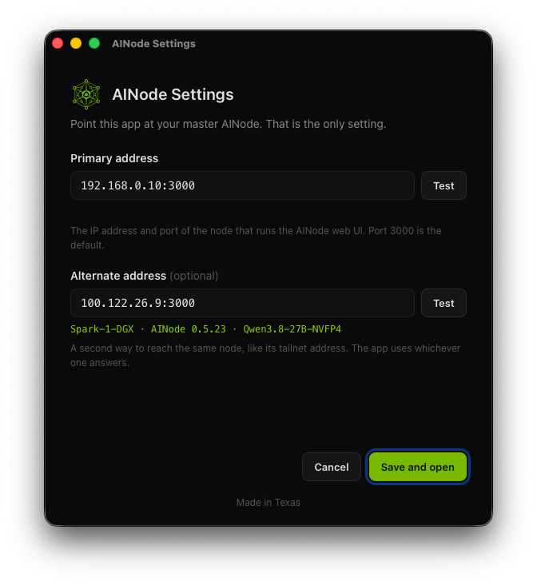
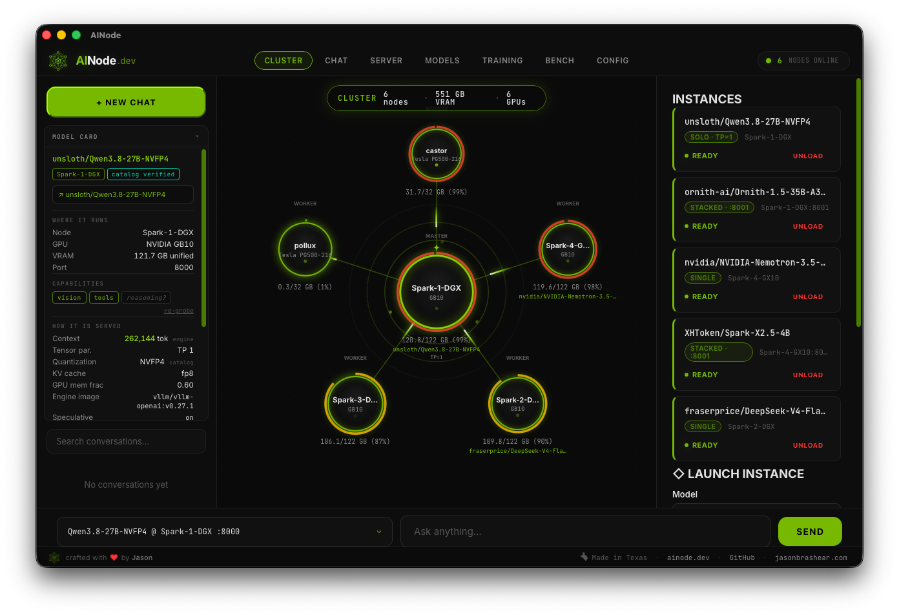
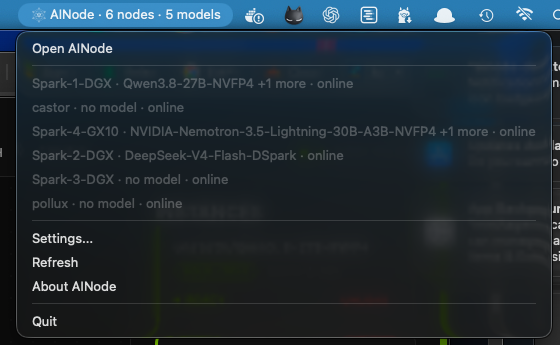

# AINode Desktop

AINode on your desktop: point it at your master node and go.

AINode Desktop is a small native app for macOS and Windows that wraps the [AINode](https://github.com/getainode/ainode) web UI. You tell it where your master AINode lives, and from then on the dashboard opens as its own app instead of a browser tab. It also puts your fleet in the menu bar and tells you when a model finishes loading.

It is a thin shell, not a rewrite. The window shows the same web UI your master already serves. The app adds the parts a browser cannot: one saved address, a menu bar item, native notifications, and a page that waits for the master when it is down.

## The one setting

Where is your master AINode?

Two fields sit behind that question:

- **Primary address**: `host:port` of the master node, for example `192.168.0.10:3000`.
- **Alternate address** (optional): a second way to reach the same node, like its tailnet address `100.122.26.9:3000`.

Each field has a **Test** button that calls `/api/status` and shows the node name and AINode version that answered. On launch the app probes both addresses at once (2 second timeout), uses whichever answers, and remembers which one worked so the next launch tries it first. The first launch with nothing saved opens this screen.

Settings are stored in the app data folder (`~/Library/Application Support/ai.ainode.desktop/settings.json` on macOS, `%APPDATA%\ai.ainode.desktop\settings.json` on Windows).

## What you get

- **Main window**: the AINode web UI at `http://<master>/`. If the master is unreachable, a bundled "Waiting for ..." page takes over and retries every 5 seconds. If the master restarts mid-session, the app notices within about 15 seconds, shows the waiting page, and goes back to the UI when the master answers again. Closing the window hides it; the app keeps running in the menu bar. Cmd+Q quits.
- **Menu bar item**: polls `/api/nodes` every 10 seconds and shows a title like `AINode · 6 nodes · 5 models`. The menu lists every node as `name · model or load progress · online/offline`, followed by Settings, Refresh, About and Quit.
- **Notifications**: when a node goes from loading to ready you get `Model is ready on Node (loaded in N min)`. When a node goes offline or comes back, you get one notification each way. Nothing fires on the first poll after launch.
- **About**: `AINode Desktop 0.1.1 · Made in Texas` and a link to [ainode.dev](https://ainode.dev).

The app only ever reads from the master (`GET /api/status`, `GET /api/nodes`). Everything you do inside the web UI goes through the UI itself, exactly as it would in a browser.

## Screenshots

The Settings screen, with the alternate address tested against a live master:



The main window showing the AINode cluster view:



The menu bar item with a six node fleet:



## Build

Requirements: Rust 1.85 or newer, Node 20 or newer, and the Xcode Command Line Tools.

```bash
npm install
npm run tauri dev      # run against the source tree
npm run tauri build    # produce src-tauri/target/release/bundle/macos/AINode.app and a .dmg
```

Tests and lints live on the Rust side:

```bash
cd src-tauri
cargo test
cargo clippy
```

The build is unsigned. To open it on another Mac, right-click the app and choose Open the first time, or clear the quarantine flag with `xattr -dr com.apple.quarantine AINode.app`.

### Windows

The same source builds on Windows: Rust with the MSVC toolchain, Node 22 and the WebView2 runtime (part of Windows 10 and 11), then `npm ci` and `npm run tauri build` for an NSIS installer and an MSI under `src-tauri\target\release\bundle\`. On Windows the menu bar is File, View, Help; the fleet lives in the system tray (colour icon, double click opens the app); closing the window hides it to the tray. Releases carry signed installers built by `.github/workflows/release-windows.yml`; see [docs/RELEASING.md](docs/RELEASING.md#windows).

### Icons

`src-tauri/icons/` holds the standard Tauri icon set. To replace it, drop a square PNG (1024 px or larger) somewhere and run `npm run tauri icon path/to/icon.png`; no config changes are needed. `tray.png` and `tray@2x.png` are the monochrome macOS menu bar template icons; the Windows tray uses `icon.ico`.

### Layout

```
src/                    the app's own pages: settings, waiting, about (plain HTML, CSS, JS)
src-tauri/src/
  lib.rs                app wiring: plugins, menu, tray, windows, poller
  config.rs             the one setting, address normalization, store load and save
  probe.rs              which address to use, given what answered
  nodes.rs              /api/nodes parsing, tray labels, the notification state machine
  poller.rs             background loop: probe, navigate, poll nodes, notify
  tray.rs, menu.rs      menu bar item and the application menu
  windows.rs            main, settings and about windows
  commands.rs           IPC for the bundled pages
src-tauri/Info.plist    App Transport Security exemption so the webview may load plain http
```

### A note on plain http

AINode masters serve the UI over plain `http` on LAN and tailnet addresses. macOS blocks that inside a webview unless the app declares `NSAllowsArbitraryLoadsInWebContent`. That single key lives in `src-tauri/Info.plist`. Do not add `NSAllowsLocalNetworking` or other keys next to it: macOS then ignores the broader exemption and the window goes blank.

## Stack

- [Tauri 2](https://tauri.app) with the system WebKit webview
- Rust: `reqwest`, `serde`, `tokio`, `tauri-plugin-store`, `tauri-plugin-notification`, `tauri-plugin-opener`
- Plain HTML, CSS and JavaScript for the app's own screens. No framework, no bundler.

## License

Apache-2.0. See [LICENSE](LICENSE).

Made in Texas.
